# 项目架构文档

## 目录

1. [项目概述](#项目概述)
2. [模块架构](#模块架构)
3. [数据库设计](#数据库设计)
4. [流程图](#流程图)
5. [时序图](#时序图)
6. [API 接口](#api-接口)
7. [部署架构](#部署架构)

---

## 项目概述

### 项目名称
智能出行+日程记录助手小程序

### 技术栈

**前端**
- Taro 4.1.9 - 跨端框架
- React 18 - UI 框架
- TypeScript - 类型安全
- Tailwind CSS 4 - 样式系统
- Zustand - 状态管理
- lucide-react-taro - 图标库

**后端**
- NestJS 10 - 应用框架
- Supabase - 数据库（PostgreSQL）
- coze-coding-dev-sdk - AI 大模型集成

**核心能力**
- AI 对话与意图理解
- 任务管理（创建、查询、更新、删除）
- 行程规划（打车、火车、飞机）
- 时间冲突检测与优化
- 用户画像与个性化推荐
- 位置服务与地图集成

---

## 模块架构

### 模块依赖关系

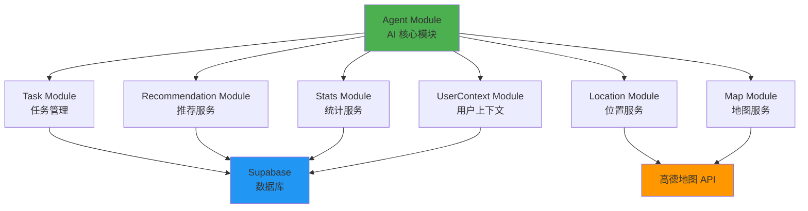

### 模块详细说明

#### 1. Agent Module (AI 核心模块)

**职责**
- AI 对话核心逻辑
- 工具调用与参数校验
- 智能重试机制
- 进度推送与流式响应

**核心组件**
- `AgentService` - Agent 核心服务
- `AgentController` - API 控制器
- `ConflictOptimizer` - 冲突优化器

**工具系统**
```
agent/tools/
├── definitions.ts      # 工具定义与参数规范
├── param-validator.ts  # 参数校验器
├── validators.ts       # 具体验证逻辑
├── task.tool.ts        # 任务管理工具
├── taxi.tool.ts        # 打车工具
├── trip.tool.ts        # 行程规划工具
├── time.tool.ts        # 时间工具
├── conflict-optimizer.ts  # 冲突优化工具
└── index.ts            # 统一执行入口
```

#### 2. UserContext Module (用户上下文模块)

**职责**
- 用户行为统计
- 用户画像生成
- 偏好分析与推荐

**核心组件**
- `UserContextService` - 用户上下文服务

#### 3. Task Module (任务管理模块)

**职责**
- 任务 CRUD 操作
- 任务状态管理
- 任务调度与过期检查

**核心组件**
- `TaskService` - 任务服务
- `TaskController` - API 控制器
- `TaskRepository` - 数据访问层
- `TaskScheduler` - 任务调度器

#### 4. Location Module (位置服务模块)

**职责**
- 地理编码与逆编码
- 位置缓存
- 地址解析

**核心组件**
- `LocationService` - 位置服务

#### 5. Map Module (地图服务模块)

**职责**
- 高德地图 API 集成
- 路径规划
- POI 搜索

**核心组件**
- `MapService` - 地图服务

#### 6. Recommendation Module (推荐模块)

**职责**
- 基于用户画像推荐
- 收藏管理
- 推荐结果缓存

**核心组件**
- `RecommendationService` - 推荐服务

#### 7. Stats Module (统计模块)

**职责**
- 任务统计
- 用户行为分析
- 数据可视化支持

**核心组件**
- `StatsService` - 统计服务

---

## 数据库设计

### 数据库表关系图

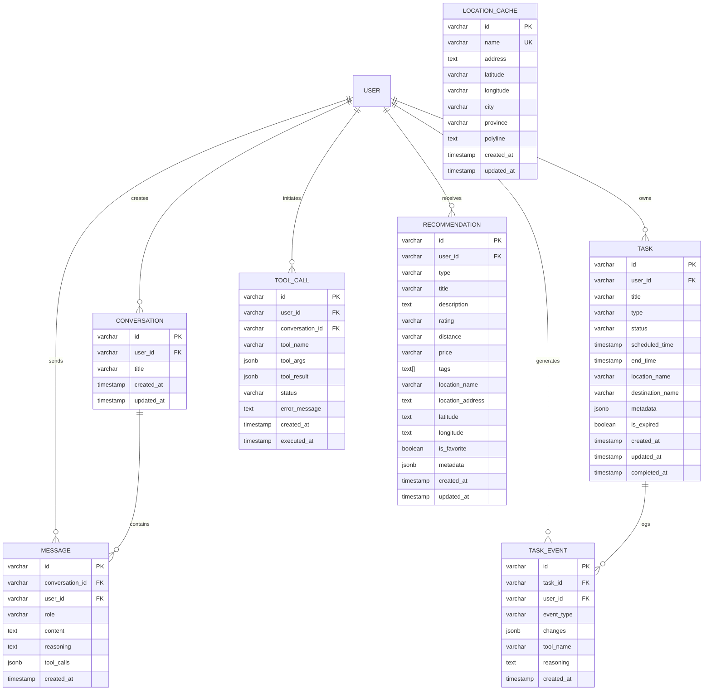

### 表结构详细说明

#### 1. location_cache (位置缓存表)

| 字段 | 类型 | 说明 | 索引 |
|------|------|------|------|
| id | varchar(36) | 主键 | PK |
| name | varchar(500) | 位置名称 | UK, idx |
| address | text | 详细地址 | - |
| latitude | varchar(50) | 纬度 | - |
| longitude | varchar(50) | 经度 | - |
| city | varchar(100) | 城市 | idx |
| province | varchar(100) | 省份 | - |
| source | varchar(50) | 数据来源 | idx |
| polyline | text | 路径编码 | - |
| created_at | timestamp | 创建时间 | - |
| updated_at | timestamp | 更新时间 | - |

#### 2. recommendations (推荐表)

| 字段 | 类型 | 说明 | 索引 |
|------|------|------|------|
| id | varchar(36) | 主键 | PK |
| user_id | varchar(255) | 用户 ID | idx |
| type | varchar(50) | 推荐类型 | idx |
| title | varchar(500) | 标题 | - |
| description | text | 描述 | - |
| rating | varchar(10) | 评分 | - |
| distance | varchar(50) | 距离 | - |
| price | varchar(50) | 价格 | - |
| tags | text[] | 标签数组 | - |
| location_name | varchar(500) | 位置名称 | - |
| location_address | text | 位置地址 | - |
| latitude | text | 纬度 | - |
| longitude | text | 经度 | - |
| is_favorite | boolean | 是否收藏 | idx |
| metadata | jsonb | 元数据 | - |
| created_at | timestamp | 创建时间 | - |
| updated_at | timestamp | 更新时间 | - |

#### 3. tasks (任务表)

| 字段 | 类型 | 说明 | 索引 |
|------|------|------|------|
| id | varchar(36) | 主键 | PK |
| user_id | varchar(255) | 用户 ID | idx |
| title | varchar(500) | 任务标题 | - |
| description | text | 任务描述 | - |
| type | varchar(50) | 任务类型 | idx |
| status | varchar(50) | 任务状态 | idx |
| scheduled_time | timestamp | 计划时间 | idx |
| end_time | timestamp | 结束时间 | - |
| duration_minutes | integer | 持续时长（分钟）| - |
| location_name | varchar(500) | 地点名称 | - |
| location_address | text | 地点地址 | - |
| latitude | text | 纬度 | - |
| longitude | text | 经度 | - |
| destination_name | varchar(500) | 目的地名称 | - |
| destination_address | text | 目的地地址 | - |
| dest_latitude | text | 目的地纬度 | - |
| dest_longitude | text | 目的地经度 | - |
| metadata | jsonb | 元数据 | - |
| is_expired | boolean | 是否过期 | idx |
| created_at | timestamp | 创建时间 | - |
| updated_at | timestamp | 更新时间 | - |
| completed_at | timestamp | 完成时间 | - |

**任务类型枚举**
- `taxi` - 打车
- `train` - 火车
- `flight` - 飞机
- `meeting` - 会议
- `dining` - 餐饮
- `hotel` - 酒店
- `todo` - 事务
- `other` - 其他

**任务状态枚举**
- `pending` - 待确认
- `confirmed` - 已确认
- `in_progress` - 进行中
- `completed` - 已完成
- `cancelled` - 已取消

#### 4. task_events (任务事件表)

| 字段 | 类型 | 说明 | 索引 |
|------|------|------|------|
| id | varchar(36) | 主键 | PK |
| task_id | varchar(36) | 任务 ID (FK) | idx |
| user_id | varchar(255) | 用户 ID | idx |
| event_type | varchar(50) | 事件类型 | - |
| changes | jsonb | 变更内容 | - |
| tool_name | varchar(100) | 工具名称 | - |
| tool_call_id | varchar(255) | 工具调用 ID | - |
| reasoning | text | AI 推理过程 | - |
| created_at | timestamp | 创建时间 | - |

#### 5. tool_calls (工具调用日志表)

| 字段 | 类型 | 说明 | 索引 |
|------|------|------|------|
| id | varchar(36) | 主键 | PK |
| user_id | varchar(255) | 用户 ID | idx |
| conversation_id | varchar(255) | 对话 ID | idx |
| tool_name | varchar(100) | 工具名称 | idx |
| tool_args | jsonb | 工具参数 | - |
| tool_result | jsonb | 工具结果 | - |
| status | varchar(50) | 执行状态 | - |
| error_message | text | 错误信息 | - |
| created_at | timestamp | 创建时间 | - |
| executed_at | timestamp | 执行时间 | - |

#### 6. conversations (对话表)

| 字段 | 类型 | 说明 | 索引 |
|------|------|------|------|
| id | varchar(36) | 主键 | PK |
| user_id | varchar(255) | 用户 ID | idx |
| title | varchar(255) | 对话标题 | - |
| created_at | timestamp | 创建时间 | - |
| updated_at | timestamp | 更新时间 | - |

#### 7. messages (消息表)

| 字段 | 类型 | 说明 | 索引 |
|------|------|------|------|
| id | varchar(36) | 主键 | PK |
| conversation_id | varchar(36) | 对话 ID (FK) | idx |
| user_id | varchar(255) | 用户 ID | idx |
| role | varchar(50) | 角色 | - |
| content | text | 内容 | - |
| reasoning | text | AI 推理过程 | - |
| tool_calls | jsonb | 工具调用记录 | - |
| tool_call_id | varchar(255) | 工具调用 ID | - |
| created_at | timestamp | 创建时间 | - |

---

## 流程图

### 1. AI 对话核心流程

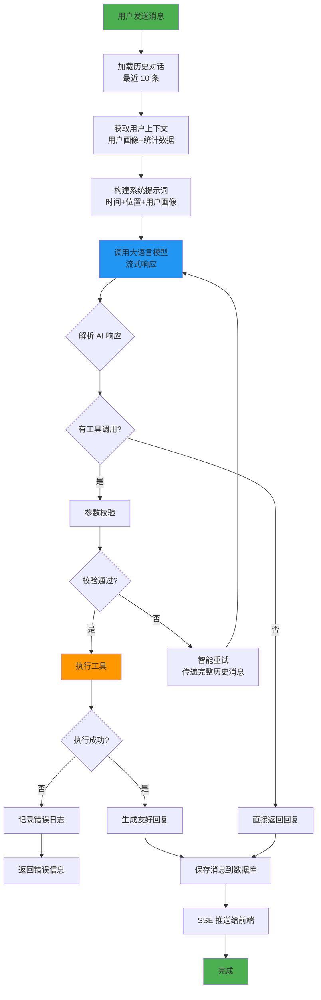

### 2. 任务创建流程（含确认机制）

```mermaid
flowchart TD
    Start[用户: "明天下午2点开会"] --> AIUnderstand[AI 理解意图]
    AIUnderstand --> CheckMissing{信息完整?}

    CheckMissing -->|否| AskUser[询问用户]
    CheckMissing -->|是| CallTool[调用 task_create<br/>confirm=false]

    AskUser --> UserReply[用户回复]
    UserReply --> AIUnderstand

    CallTool --> SaveTask[保存任务<br/>status=pending]
    SaveTask --> SaveEvent[记录任务事件]
    SaveEvent --> ReturnPreview[返回预览信息]

    ReturnPreview --> FrontendDisplay[前端显示确认弹窗]
    FrontendDisplay --> UserConfirm{用户确认?}

    UserConfirm -->|确定| CallConfirm[调用 task_create<br/>confirm=true]
    UserConfirm -->|取消| DeletePending[删除 pending 任务]

    CallConfirm --> UpdateStatus[更新 status=confirmed]
    UpdateStatus --> SaveConfirmEvent[记录确认事件]
    SaveConfirmEvent --> CheckConflict[检查时间冲突]

    CheckConflict --> HasConflict{有冲突?}
    HasConflict -->|是| CallOptimizer[调用冲突优化]
    HasConflict -->|否| Complete[完成创建]

    CallOptimizer --> ShowOptions[显示优化方案]
    ShowOptions --> UserSelectOpt[用户选择优化方案]
    UserSelectOpt --> ApplySolution[应用优化方案]
    ApplySolution --> Complete

    DeletePending --> Cancel[取消创建]
    Complete --> End[任务创建成功]
    Cancel --> End

    style Start fill:#4CAF50
    style End fill:#4CAF50
    style CallTool fill:#FF9800
    style CallConfirm fill:#2196F3
    style CallOptimizer fill:#9C27B0
```

### 3. 行程规划流程

```mermaid
flowchart TD
    Start[用户: "下周去上海出差"] --> AIAnalyze[AI 分析需求]
    AIAnalyze --> CheckHistory[查询历史行程]
    CheckHistory --> GetLocation[获取当前位置]

    GetLocation --> CallAmap[调用高德 API<br/>规划路线]
    CallAmap --> ParseRoutes[解析路线方案]

    ParseRoutes --> SplitTrips[拆分为多段行程]
    SplitTrips --> GenerateTasks[生成任务预览]

    GenerateTasks --> CheckConflicts[检查时间冲突]
    CheckConflicts --> HasConflict{有冲突?}

    HasConflict -->|是| Optimize[生成优化方案]
    HasConflict -->|否| ShowRoutes[展示路线方案]

    Optimize --> ShowRoutes
    ShowRoutes --> UserSelectRoute{用户选择?}

    UserSelectRoute -->|选择路线| CreateTasks[批量创建任务]
    UserSelectRoute -->|自定义| CustomRoute[自定义路线]

    CustomRoute --> CallAmap
    CreateTasks --> SaveTasks[保存到数据库]
    SaveTasks --> End[行程规划完成]

    style Start fill:#4CAF50
    style End fill:#4CAF50
    style CallAmap fill:#FF9800
    style CreateTasks fill:#2196F3
```

### 4. 智能重试流程

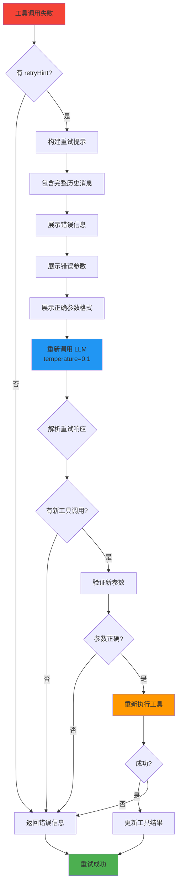

### 5. 用户画像生成流程

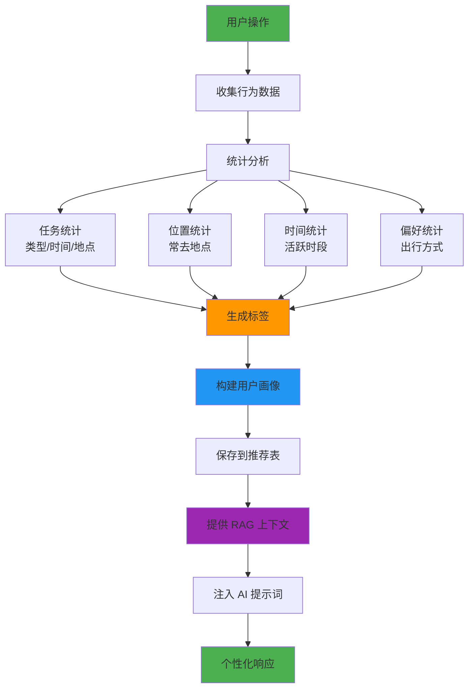

---

## 时序图

### 1. 用户对话完整时序

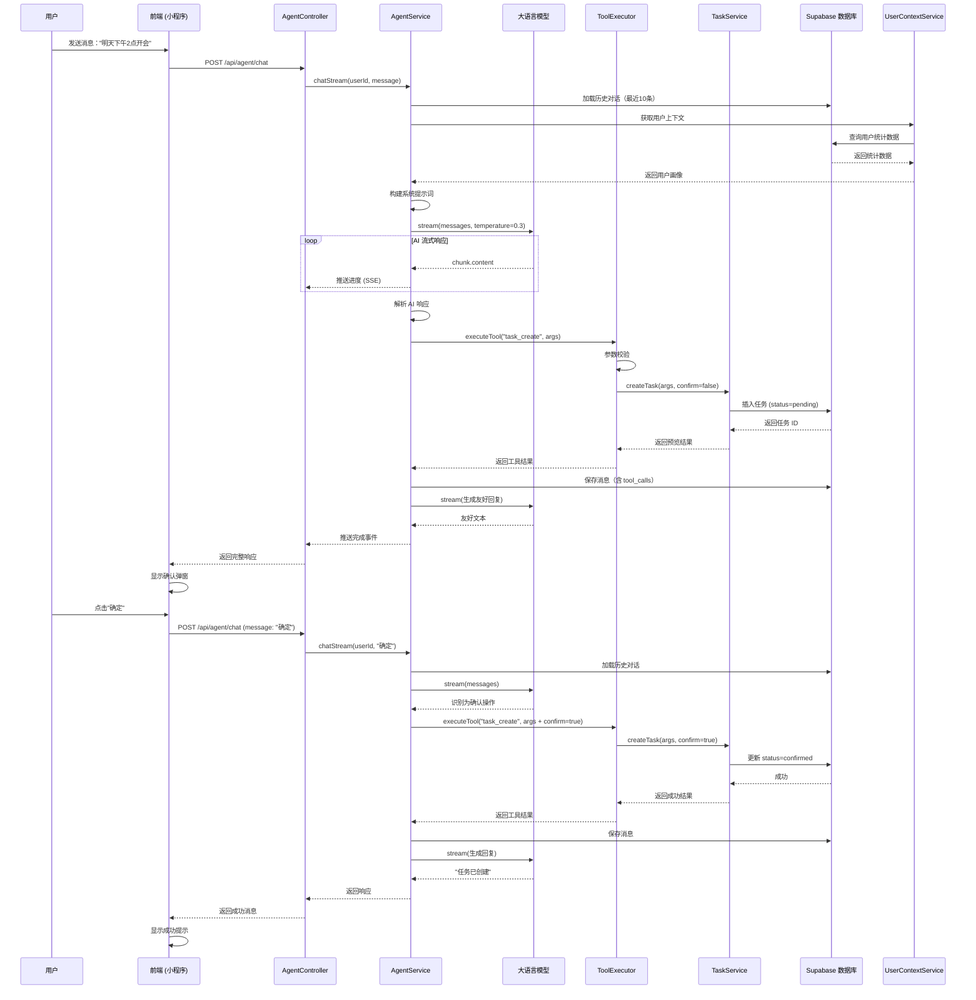

### 2. 行程规划时序

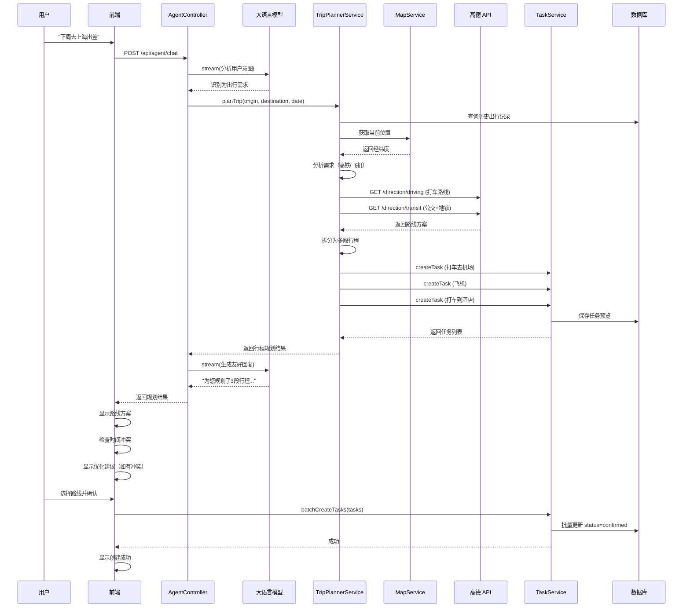

### 3. 时间冲突检测与优化时序

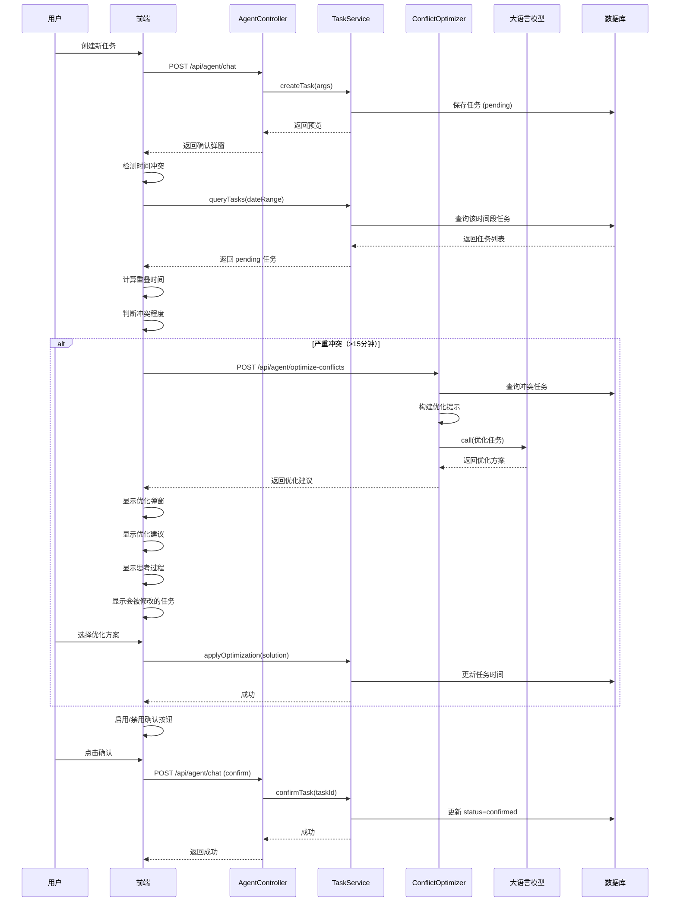

### 4. 智能重试时序

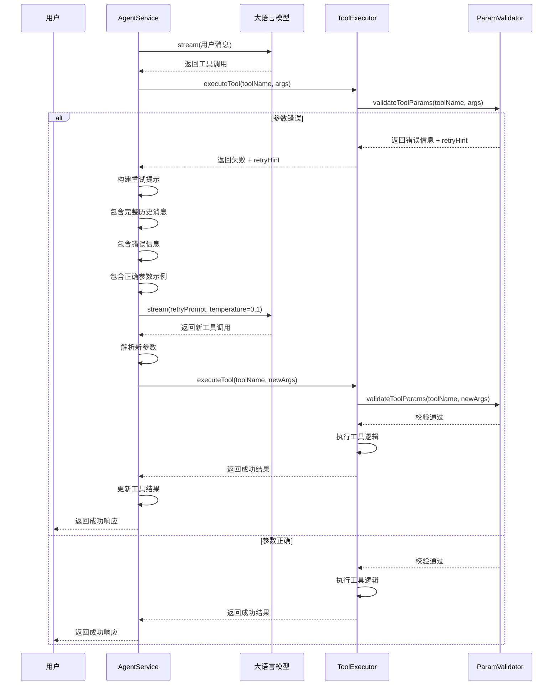

---

## API 接口

### 1. Agent 接口

#### 聊天对话
```
POST /api/agent/chat
```

**请求参数**
```json
{
  "message": "用户消息",
  "userId": "用户ID",
  "location": {
    "latitude": 30.2741,
    "longitude": 120.1551,
    "name": "杭州"
  }
}
```

**响应格式（SSE 流式）**
```
event: start
data: {"message": "正在思考..."}

event: reasoning
data: {"step": "正在理解您的需求..."}

event: reasoning
data: {"step": "准备执行: task_create"}

event: content
data: {"content": "好的"}

event: done
data: {
  "content": "完整的回复文本",
  "reasoning": ["思考步骤1", "思考步骤2"],
  "tool_results": [...],
  "data": {
    "needConfirmation": true,
    "confirmType": "batch_add",
    "pendingTasks": [...]
  }
}
```

#### 冲突优化
```
POST /api/agent/optimize-conflicts
```

**请求参数**
```json
{
  "userId": "用户ID",
  "newTask": {
    "title": "新任务",
    "type": "meeting",
    "scheduled_time": "2025-01-15T14:00:00+08:00"
  },
  "conflictingTasks": [
    {
      "id": "任务ID",
      "title": "冲突任务",
      "scheduled_time": "2025-01-15T13:30:00+08:00"
    }
  ]
}
```

**响应格式**
```json
{
  "code": 200,
  "data": {
    "analysis": "冲突分析结果",
    "suggestions": [
      {
        "type": "adjust_time",
        "description": "调整任务时间",
        "taskId": "任务ID",
        "newTime": "2025-01-15T15:00:00+08:00"
      }
    ],
    "reasoning": "AI 思考过程",
    "affectedTasks": [...]
  }
}
```

### 2. Task 接口

#### 创建任务
```
POST /api/tasks
```

#### 查询任务
```
GET /api/tasks?date=2025-01-15&type=meeting&status=pending
```

#### 更新任务
```
PATCH /api/tasks/:id
```

#### 删除任务
```
DELETE /api/tasks/:id
```

#### 完成任务
```
POST /api/tasks/:id/complete
```

### 3. Location 接口

#### 地理编码
```
POST /api/location/geocode
```

**请求参数**
```json
{
  "address": "杭州市西湖区"
}
```

**响应格式**
```json
{
  "latitude": "30.2741",
  "longitude": "120.1551",
  "formatted_address": "浙江省杭州市西湖区"
}
```

#### 逆地理编码
```
POST /api/location/reverse-geocode
```

**请求参数**
```json
{
  "latitude": 30.2741,
  "longitude": 120.1551
}
```

### 4. Map 接口

#### 路线规划
```
POST /api/map/direction
```

**请求参数**
```json
{
  "origin": { "latitude": 30.2741, "longitude": 120.1551 },
  "destination": { "latitude": 31.2304, "longitude": 121.4737 },
  "mode": "driving"
}
```

**响应格式**
```json
{
  "routes": [
    {
      "distance": "180公里",
      "duration": "2小时30分钟",
      "polyline": "路线编码",
      "steps": [...]
    }
  ]
}
```

### 5. Stats 接口

#### 用户统计
```
GET /api/stats/user/:userId
```

**响应格式**
```json
{
  "totalTasks": 150,
  "completedTasks": 120,
  "completionRate": 0.8,
  "mostUsedTypes": [
    { "type": "meeting", "count": 50 },
    { "type": "taxi", "count": 30 }
  ],
  "frequentLocations": [
    { "name": "会议室A", "count": 40 }
  ],
  "peakHours": [
    { "hour": 14, "count": 25 }
  ]
}
```

### 6. Recommendation 接口

#### 获取推荐
```
GET /api/recommendations/:userId?type=restaurant
```

**响应格式**
```json
{
  "recommendations": [
    {
      "id": "rec_001",
      "type": "restaurant",
      "title": "西湖醋鱼",
      "rating": "4.8",
      "distance": "1.2km",
      "price": "中等",
      "tags": ["杭帮菜", "经典"],
      "location": {...}
    }
  ]
}
```

#### 收藏推荐
```
POST /api/recommendations/:id/favorite
```

---

## 部署架构

### 系统架构图

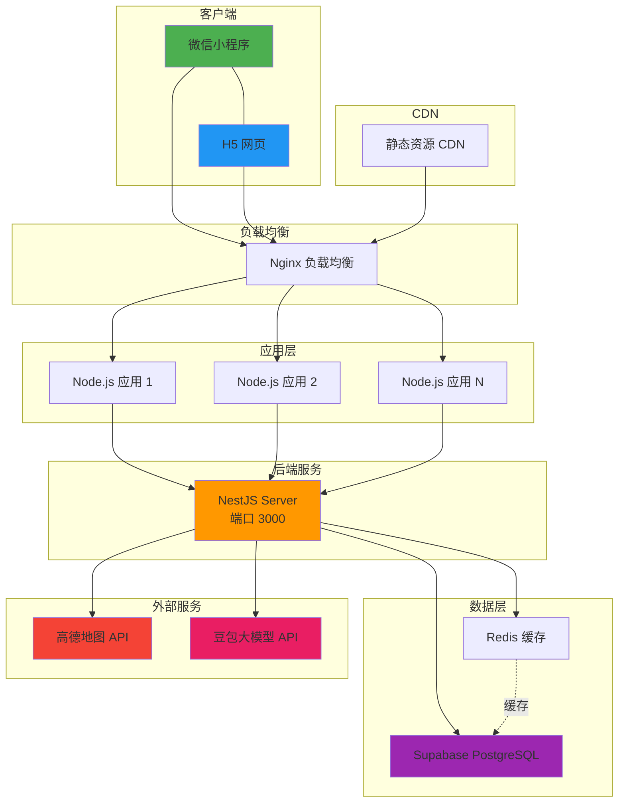

### 部署流程

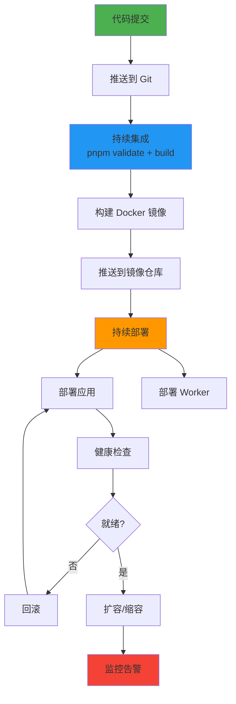

### 数据流

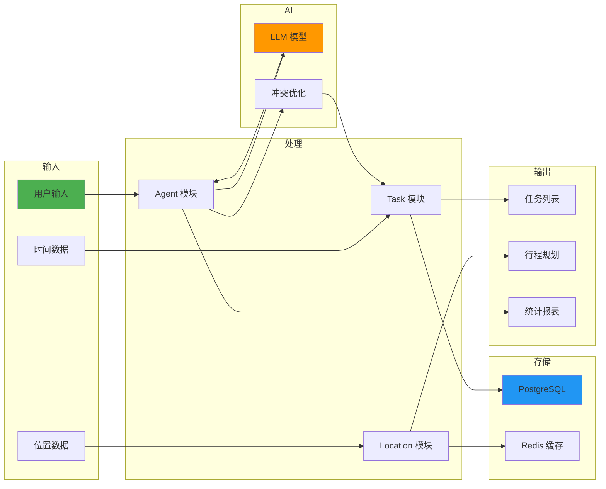

---

## 附录

### 技术栈版本

| 技术 | 版本 |
|------|------|
| Node.js | 18.x |
| pnpm | 8.x |
| Taro | 4.1.9 |
| React | 18.x |
| NestJS | 10.x |
| TypeScript | 5.x |
| Tailwind CSS | 4.x |
| Drizzle ORM | latest |
| Supabase | latest |
| coze-coding-dev-sdk | latest |

### 环境变量

```env
# 数据库
DATABASE_URL=postgresql://...

# Supabase
SUPABASE_URL=...
SUPABASE_ANON_KEY=...
SUPABASE_SERVICE_ROLE_KEY=...

# 高德地图
AMAP_KEY=...

# AI 模型
COZE_API_KEY=...
COZE_MODEL=doubao-seed-1-6-lite-251015

# 应用配置
PORT=3000
NODE_ENV=production
```

### 性能优化策略

1. **数据库优化**
   - 添加索引（user_id, type, status, scheduled_time）
   - 使用连接池
   - Redis 缓存热门查询

2. **API 优化**
   - SSE 流式响应
   - 请求去重
   - 参数校验前置

3. **前端优化**
   - 虚拟滚动（长列表）
   - 图片懒加载
   - 状态持久化

4. **AI 优化**
   - 智能重试减少重复调用
   - 上下文缓存
   - 温度参数调优

---

**文档版本**: v1.0.0
**最后更新**: 2025-04-09
**维护者**: 开发团队
